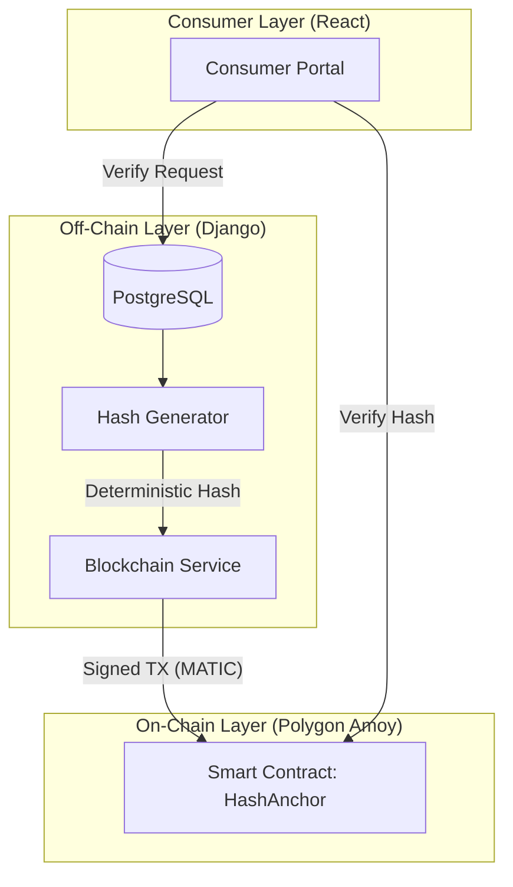

# AgriChain: Enterprise Blockchain Implementation Manual

This document provides a comprehensive technical analysis of the blockchain integration within the AgriChain platform. It serves as the definitive guide for developers, auditors, and system architects.

---

## 1. System Architecture & The "Anchor" Paradigm

AgriChain employs a **Hybrid State Model**. While traditional transactional data resides in a relational database (PostgreSQL) for performance and flexibility, its **Integrity Proofs** are anchored to the Polygon Amoy Blockchain.

### The Anchor Concept
An "Anchor" is a permanent, immutable record on the blockchain that contains:
1.  **Batch Identity**: A unique cryptographic mapping to the product batch.
2.  **State Hash**: A SHA256 "fingerprint" of the entire batch data (including history).
3.  **Context**: The specific lifecycle event (e.g., `CREATED`, `DELIVERED`).

---

## 2. Cryptographic Foundation: `hash_generator.py`

The security of the system relies on **Deterministic Hashing**. If a single character in the database is changed, the generated hash will not match the one on the blockchain.

### Hashing Logic
The `generate_canonical_data` function extracts a "Snapshot" of the batch.
- **Core Fields**: `product_batch_id`, `crop_type`, `quantity`, `farm_location`.
- **Financial Details**: `farmer_base_price_per_unit`, `distributor_margin_per_unit`.
- **Event Audit Trail**: The *entire* history of events (status changes, timestamps, and performers) is serialized and included in the hash. 

> [!WARNING]
> Because event history is included, you cannot retroactively change a status or timestamp in the database without breaking the blockchain verification.

---

## 3. Blockchain Infrastructure: `BlockchainService`

The `BlockchainService` (`blockchain_service.py`) is the engine that drives the integration.

### Smart Contract Specifications
- **Name**: `HashAnchor`
- **Standard**: Custom Integrity Protocol (Upheld by OpenZeppelin AccessControl)
- **Network**: Polygon Amoy Testnet (Chain ID: `80002`)
- **Contract Address**: `0x545302340823504C32268b64284728a6278083c7`
- **Explorer**: [PolygonScan Amoy](https://amoy.polygonscan.com/address/0x545302340823504C32268b64284728a6278083c7)

### Transaction Management
The service uses `web3.py` to:
- **Sign Transactions**: Uses the `ANCHORER_PRIVATE_KEY` stored in environment variables.
- **Manage Gas**: Calculates current `gasPrice` and handles nonces to prevent transaction collisions.
- **Poll for Receipts**: Uses a 120-second timeout to wait for block confirmation.

---

## 4. Automated Integration Workflow: `event_logger.py`

Blockchain anchoring is not a manual task; it is integrated into the core business logic via the `log_batch_event` utility.

### Critical Event Anchoring
The system automatically triggers an on-chain anchor for the following `CRITICAL_BLOCKCHAIN_EVENTS`:
- `CREATED`: Initial batch generation.
- `DELIVERED_TO_DISTRIBUTOR`: First transfer of custody.
- `DELIVERED_TO_RETAILER`: Arrival at point of sale.
- `SOLD`: Final consumption.

### Reliability & Retries
If the network is congested or the wallet is empty, the system **fails gracefully**.
1.  The database event is created regardless of blockchain status.
2.  The error is logged in the event's `metadata`.
3.  Admins can use the `RetryAnchorView` (`POST /api/events/{id}/retry-anchor/`) to re-attempt the anchor once funds are available.

---

## 5. Consumer Portals & Verification UI

The **Consumer Portal** (`ConsumerTrace.jsx`) is the primary interface for "Proof of Origin".

### Verification Logic
When a QR code is scanned (`/public/trace/{id}`):
1.  **Frontend State**: Displays a loading state while fetching `verifyBatch` and `getBatchAnchors`.
2.  **Integrity Check**: The backend compares the current DB hash with the latest on-chain hash.
3.  **UI Components**:
    - `<VerificationBadge />`: High-level "Verified" or "Tampered" status.
    - `<BlockchainIntegrityCard />`: Detailed breakdown showing the hashes side-by-side.
    - `<AnchorHistory />`: A searchable timeline of every time the batch was "touched" on the blockchain.

---

## 6. Maintenance & Operational Guide

### 💸 Wallet Management
The "Anchorer" wallet must always maintain a balance of test MATIC.
- **Address**: `0x54D8B7D4C3FCA9e2a6341F3aB4D24d2c1812f406`
- **Faucets**: [Polygon Faucet](https://faucet.polygon.technology/)

### 🔍 System Audit API
Developers can monitor the system using these specialized endpoints:
- **System Health**: `GET /api/blockchain/status/`
- **Audit Logs**: `GET /api/batch/{id}/anchors/` (Returns full on-chain history).
- **Manual Anchor**: `POST /api/batch/{id}/anchor/` (Emergency sync).

---

## 7. Codebase Directory Structure (Blockchain)

For developers looking to extend the blockchain functionality, here are the key files:

### Backend (`Backend/bsas_supplychain-main/supplychain/`)
- `blockchain_service.py`: Core logic for Web3, contract interaction, and gas management.
- `hash_generator.py`: Cryptographic functions for deterministic batch hashing.
- `event_logger.py`: Automatic anchoring of lifecycle events.
- `blockchain_views.py`: REST API endpoints for verification and audit.
- `batch_validators.py`: (Internal) Ensures batch data is in a valid state for anchoring.

### Frontend (`Frontend/agri-supply-chain/src/`)
- `services/blockchainService.js`: Frontend wrapper for blockchain API calls.
- `components/blockchain/VerificationBadge.jsx`: Visual status indicator (Shield icon).
- `components/blockchain/BlockchainIntegrityCard.jsx`: Detailed side-by-side hash comparison.
- `components/blockchain/AnchorHistory.jsx`: Searchable list of on-chain audit records.
- `pages/public/ConsumerTrace.jsx`: Main entry point for consumer verification.

---
*Document Version: 2.1.0*
*Last Revision: March 8, 2026*
*Author: AgriChain Engineering Team*
